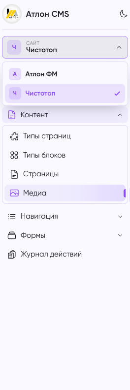

# MoonShine Tenant Switcher

Переключатель проекта (tenant) для админки [MoonShine](https://moonshine-laravel.com) v4:

- выпадающий список тенантов в шапке/боковом меню админки;
- автоматический скоуп ресурсов по выбранному тенанту (глобальный Eloquent-scope);
- авто-проставление внешнего ключа тенанта при создании записей;
- выбор хранится в сессии; режим «всегда ровно один тенант».

Скоуп **активен только под админ-guard** (по умолчанию `moonshine`) — публичный фронт и консоль не затрагиваются.



## Установка

Пакет подключается как локальный (path-репозиторий):

```jsonc
// composer.json приложения
"repositories": [
    { "type": "path", "url": "packages/moonshine-tenant-switcher", "options": { "symlink": true } }
],
"require": { "uitlaber/moonshine-tenant-switcher": "^1.0" }
```

```bash
composer require uitlaber/moonshine-tenant-switcher
php artisan vendor:publish --tag=tenant-switcher-config   # опционально
```

## Настройка

`config/tenant-switcher.php`:

```php
return [
    'tenant_model'  => \App\Models\Site::class, // обязательно
    'foreign_key'   => 'site_id',               // FK тенанта на скоупящихся моделях
    'label_column'  => 'name',                  // что показывать в списке
    'active_column' => 'is_active',             // показывать только активных (null — всех)
    'order_column'  => 'sort',
    'session_key'   => 'moonshine_tenant_id',
    'guard'         => 'moonshine',             // guard, под которым включается скоуп
];
```

## Использование

### 1. Пометить модели тенанта

Прямой внешний ключ (`site_id`):

```php
use Uitlaber\MoonShineTenantSwitcher\Concerns\BelongsToTenant;

class Page extends Model
{
    use BelongsToTenant;
}
```

Непрямая связь (например, `MenuItem` принадлежит тенанту через `menu`):

```php
use Uitlaber\MoonShineTenantSwitcher\Concerns\BelongsToTenant;
use Illuminate\Database\Eloquent\Builder;

class MenuItem extends Model
{
    use BelongsToTenant;

    public function shouldAutoAssignTenant(): bool
    {
        return false; // у модели нет своей колонки FK
    }

    public function applyTenantScope(Builder $builder, int|string $tenantId): void
    {
        $builder->whereHas('menu', fn (Builder $q) => $q->where('site_id', $tenantId));
    }
}
```

FK можно переопределить на модели свойством `protected $tenantForeignKey = '...';`.

### 2. Добавить переключатель в layout

```php
use Uitlaber\MoonShineTenantSwitcher\Components\TenantSwitcher;

final class MoonShineLayout extends AppLayout
{
    // sidebar-режим (по умолчанию)
    protected function sidebarSlot(): array
    {
        return [TenantSwitcher::make()];
    }

    // topbar-режим
    protected function topBarSlot(): array
    {
        return [TenantSwitcher::make()];
    }
}
```

### 3. (Опционально) Доступ по сайтам для пользователей

Чтобы ограничить, какие тенанты доступны конкретному пользователю админки,
реализуйте на модели пользователя контракт `HasTenantAccess`:

```php
use Uitlaber\MoonShineTenantSwitcher\Contracts\HasTenantAccess;

class MoonShineUser extends \MoonShine\Laravel\Models\MoonshineUser implements HasTenantAccess
{
    public function sites(): BelongsToMany
    {
        return $this->belongsToMany(Site::class, 'moonshine_user_site', 'moonshine_user_id', 'site_id');
    }

    public function accessibleTenantIds(): ?array
    {
        return $this->isSuperUser() ? null : $this->sites()->pluck('sites.id')->all();
    }
}
```

`null` — доступ ко всем тенантам (супер-админ). Массив id — только указанные.
Список в переключателе, валидация переключения и дефолтный тенант
автоматически учитывают этот доступ.

Модель подключается через `config('moonshine.auth.model')`.

## Как это работает

- Трейт `BelongsToTenant` вешает глобальный `TenantScope` и хук `creating`.
- `TenantScope::apply()` фильтрует запрос только если `TenantManager::isActive()` (аутентифицирован admin-guard) и в сессии есть текущий тенант.
- Способ фильтрации делегируется модели (`applyTenantScope`), поэтому модели со связью через relation легко переопределяют условие.
- `POST {prefix}/tenant/switch` (имя роута `moonshine.tenant-switch`) меняет текущего тенанта в сессии.

## API

`Uitlaber\MoonShineTenantSwitcher\TenantManager`:

| Метод | Назначение |
|---|---|
| `isActive(): bool` | активен ли скоуп сейчас |
| `currentId(): int\|string\|null` | id текущего тенанта (или первый доступный) |
| `current(): ?Model` | модель текущего тенанта |
| `setCurrent($id): void` | задать текущего тенанта |
| `options(): array` | `[id => label]` для списка |
| `tenants(): Collection` | доступные тенанты |
